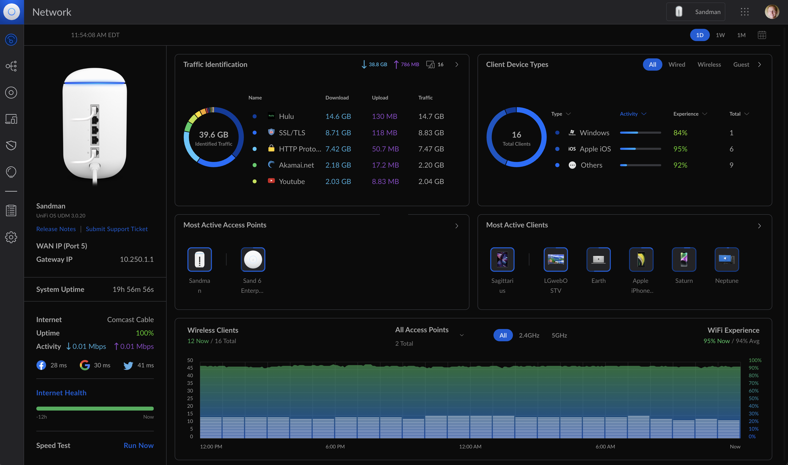

# UniFi Network pour YunoHost

[](https://dash.yunohost.org/appci/app/unifi)
[](https://install-app.yunohost.org/?app=unifi)

*[Read this README in English](README.md)*

> *Ce paquet vous permet d'installer UniFi Network rapidement et simplement sur un serveur YunoHost.
> Si vous n'avez pas YunoHost, consultez [le guide](https://yunohost.org/install) pour apprendre comment l'installer.*

## Vue d'ensemble

UniFi Network est le contrôleur de gestion réseau auto-hébergé développé par Ubiquiti.
Il vous permet de gérer centralement toute votre infrastructure réseau Ubiquiti — points d'accès,
commutateurs, passerelles de sécurité et autres équipements UniFi — depuis une seule interface web.

**Fonctionnalités principales :**

- Tableau de bord unifié en temps réel pour le trafic, les clients et l'état des équipements
- Gestion sans-fil complète : SSID, VLAN, réseaux invités et portails captifs
- Gestion des commutateurs : VLAN, profils de ports, PoE et agrégation de liens
- Passerelle de sécurité : règles de pare-feu, mise en forme du trafic et support VPN
- Portail invité optionnel avec portail captif personnalisable
- Test de vitesse optionnel via l'application mobile
- Sauvegardes planifiées intégrées de la configuration du contrôleur
- Itinérance transparente des clients entre les points d'accès

> **Note :** Ce paquet installe uniquement le **contrôleur logiciel**. Du matériel Ubiquiti
> (points d'accès, commutateurs, passerelles…) sur votre réseau local est nécessaire séparément.

**Version incluse :** 8.6.9

**Site officiel :** <https://ui.com>

**Documentation officielle :** <https://help.ui.com/hc/en-us/articles/220066768>

## Captures d'écran



## Prérequis

- YunoHost >= 12.0.9
- Architecture : **amd64 uniquement** (Ubiquiti ne publie pas de paquets ARM via son dépôt APT)
- L'application doit être installée à la **racine d'un (sous-)domaine dédié** — les installations
  sur sous-chemin (ex. `example.com/unifi`) ne sont pas supportées par l'application

## Installation

```bash
sudo yunohost app install https://github.com/YunoHost-Apps/unifi_ynh
```

Lors de l'installation, les questions suivantes vous seront posées :

| Question | Description |
|----------|-------------|
| Domaine | Le (sous-)domaine dédié au contrôleur (ex. `unifi.example.com`) |
| Portail invité | Ouvre les ports pare-feu pour la fonctionnalité de portail captif invité |
| Test de vitesse | Ouvre le port pare-feu pour le test de vitesse de l'application mobile |

Après installation, ouvrez `https://votre-domaine/` pour terminer **l'assistant de configuration
initiale** et créer votre compte administrateur local.

## Mise à jour

```bash
sudo yunohost app upgrade unifi
```

> Après une mise à jour majeure, le contrôleur effectue une migration de base de données au
> premier démarrage. Attendez que l'interface web redevienne disponible avant de l'utiliser —
> cela peut prendre plusieurs minutes.

## Sauvegarde et restauration

```bash
# Sauvegarde
sudo yunohost backup create --apps unifi

# Restauration
sudo yunohost backup restore <nom_sauvegarde> --apps unifi
```

La sauvegarde inclut l'intégralité de l'état du contrôleur (`/var/lib/unifi`) : topologie réseau,
enregistrements des équipements, configuration WiFi/VLAN et archives de sauvegarde automatique UniFi.

## Documentation

- [Documentation officielle UniFi](https://help.ui.com/hc/en-us/articles/220066768)
- [Notes d'administration YunoHost pour ce paquet](doc/ADMIN_fr.md)

## Contribuer

Merci d'envoyer vos pull requests vers la branche **testing** :

```bash
# Installer depuis la branche testing
sudo yunohost app install https://github.com/YunoHost-Apps/unifi_ynh/tree/testing --debug

# Mettre à jour depuis la branche testing
sudo yunohost app upgrade unifi -u https://github.com/YunoHost-Apps/unifi_ynh/tree/testing --debug
```

## Licence

Ce paquet YunoHost est distribué sous licence [AGPL-3.0](LICENSE).

L'application UniFi Network elle-même est un logiciel propriétaire appartenant à Ubiquiti Inc.
Consultez le [CLUF d'Ubiquiti](https://www.ui.com/legal/termsofservice/) pour ses conditions d'utilisation.
